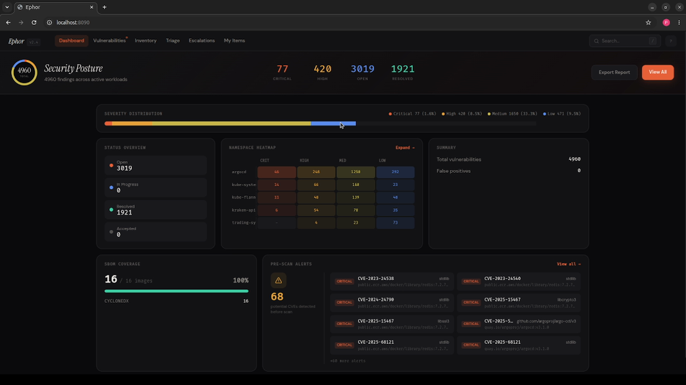

# Ephor

**Everything that happens after the scan.**

Trivy and Grype find your CVEs. Then the JSON scrolls off the terminal and nobody tracks what got fixed. Ephor is the open-source dashboard, triage, and remediation layer for Kubernetes vulnerabilities — self-hosted, your scan data never leaves your cluster.

[Website](https://holbein.io) · [Docs](https://docs.holbein.io) · [Blog](https://holbein.io/blog) · [Scanner agent](https://github.com/holbein-io/ephor-scanner)

<!-- TODO: add hero screenshot/GIF once recorded, e.g.:

-->

## Features

- **Pre-scan CVE alerts** — Ephor indexes the SBOM of every image it sees and matches known CRITICAL/HIGH CVEs against the whole fleet by exact package and version. When a vulnerable package is already sitting in images that haven't been scanned yet, you find out now, not a scan cycle later.
- **Unified dashboard** — severity breakdowns, trend charts, and search across every image, namespace, and cluster
- **Triage workflows** — status management, comments, and a full audit trail
- **Escalation management** for critical findings
- **Remediation tracking** with SLA monitoring
- **SBOM inventory** — package search, version diff, and license breakdown across images
- **Scan ingestion REST API**
- Multi-arch container images (amd64/arm64)

## Architecture

```
                 +-----------------+
                 |    Dashboard    |
                 | (React / Nginx) |
                 +--------+--------+
                          |
                     HTTP /api/v1
                          |
                 +--------v--------+
                 |       API       |
                 | (Spring Boot)   |
                 +--------+--------+
                          |
                       JDBC
                          |
                 +--------v--------+
                 |   PostgreSQL    |
                 +-----------------+
```

**Tech stack:** Java 21, Spring Boot 3.5, React 18, TypeScript, Vite, Tailwind CSS, PostgreSQL 17

## Quick Start

Prerequisites: [Docker](https://docs.docker.com/get-docker/) and [Docker Compose](https://docs.docker.com/compose/install/).

```bash
git clone https://github.com/holbein-io/ephor.git
cd ephor
docker compose up --build
```

Open [http://localhost:3000](http://localhost:3000) to access the dashboard.

> In the default Docker Compose configuration, authentication is bypassed and a development user is automatically injected. This is intended for local development only.

## Local Development

### API

Prerequisites: JDK 21, a running PostgreSQL instance (or start one with Docker Compose).

```bash
# Start only PostgreSQL
docker compose up postgres -d

# Run the API
SPRING_PROFILES_ACTIVE=local ./gradlew :api:bootRun
```

The API is available at `http://localhost:8080/api/v1`.

API documentation (Swagger UI) is available at `http://localhost:8080/api/v1/swagger-ui/index.html` when the API is running. The raw OpenAPI spec can be fetched from `http://localhost:8080/api/v1/api-docs`.

### Dashboard

Prerequisites: Node.js >= 22.

```bash
cd dashboard/app
npm install
npm run dev
```

The dashboard is available at `http://localhost:3000` and auto-proxies `/api` requests to the API on port 8080.

### Running Tests

```bash
# API tests
./gradlew :api:test

# Dashboard tests
cd dashboard/app && npm test
```

## Kubernetes Deployment

A Helm chart is provided in `charts/ephor/`.

```bash
helm install ephor charts/ephor
```

### Key Configuration Values

| Value | Description | Default |
|---|---|---|
| `ingress.enabled` | Enable ingress resource | `false` |
| `ingress.className` | Ingress class name | `""` |
| `postgresql.enabled` | Deploy bundled PostgreSQL | `true` |
| `externalDatabase.host` | External database hostname (when `postgresql.enabled=false`) | `""` |
| `api.image.tag` | API image tag | Chart `appVersion` |
| `dashboard.image.tag` | Dashboard image tag | Chart `appVersion` |
| `api.resources.limits.memory` | API memory limit | `1Gi` |

To use an external database instead of the bundled PostgreSQL:

```bash
helm install ephor charts/ephor \
  --set postgresql.enabled=false \
  --set externalDatabase.host=db.example.com \
  --set externalDatabase.password=secret
```

See `charts/ephor/values.yaml` for the full list of configurable values.

## Configuration

All runtime configuration follows the 12-factor methodology and is managed through environment variables.

| Variable | Description | Default |
|---|---|---|
| `SPRING_DATASOURCE_URL` | JDBC connection string | `jdbc:postgresql://localhost:5432/ephor` |
| `SPRING_DATASOURCE_USERNAME` | Database username | `ephor` |
| `SPRING_DATASOURCE_PASSWORD` | Database password | `ephor` |
| `AUTH_ENABLED` | Enable authentication | `true` |
| `AUTH_DEV_ENABLED` | Inject a development user (bypasses auth) | `false` |
| `LOGGING_STRUCTURED_FORMAT_CONSOLE` | Structured log format (`ecs`, `logstash`, or blank) | _(none)_ |
| `PORT` | Server listen port | `8080` |

## Project Structure

```
ephor/
  api/              Spring Boot API service
  dashboard/app/    React dashboard (Vite + TypeScript)
  charts/ephor/     Helm chart for Kubernetes deployment
  docs/             Project documentation
  docker-compose.yml
```

## Contributing

Contributions are welcome. Please read our [Contributing Guide](CONTRIBUTING.md) for details on the development workflow, commit conventions, and pull request process.

All contributors must sign our [Contributor License Agreement](CLA.md) before their first pull request can be accepted. A GitHub Action will guide you through the process automatically.

## License

This project is licensed under the [GNU Affero General Public License v3.0](LICENSE).
